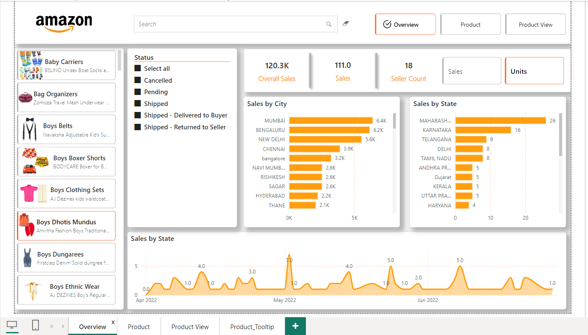
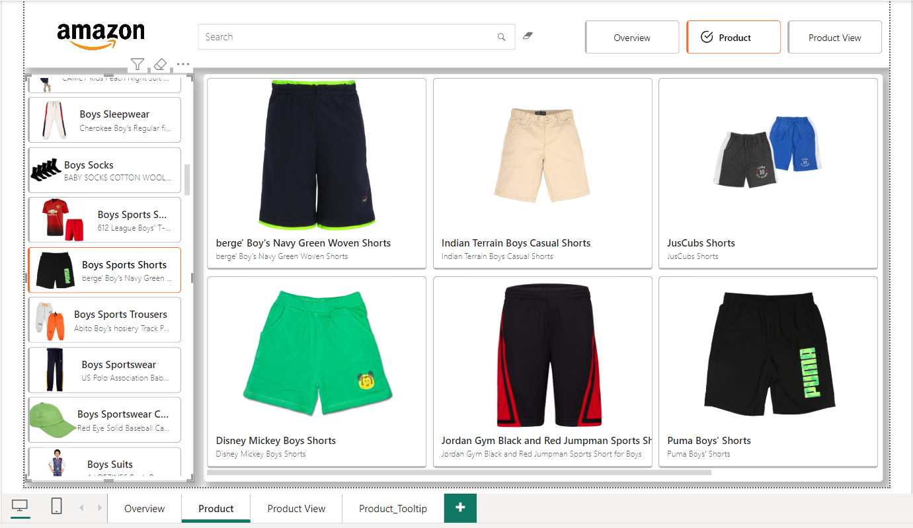
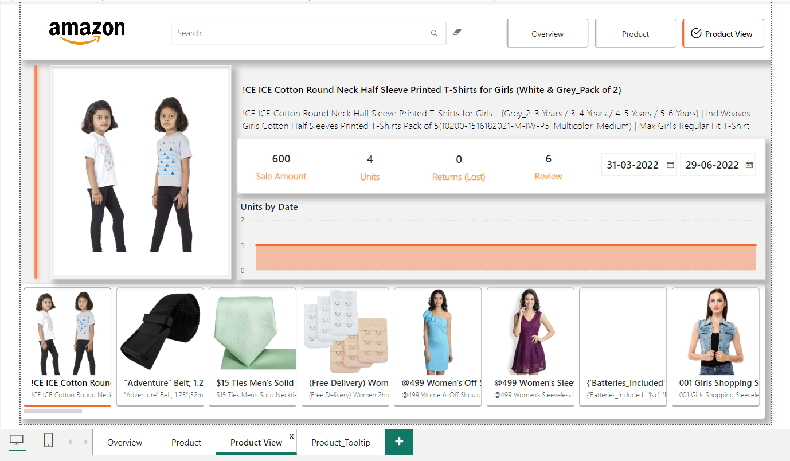
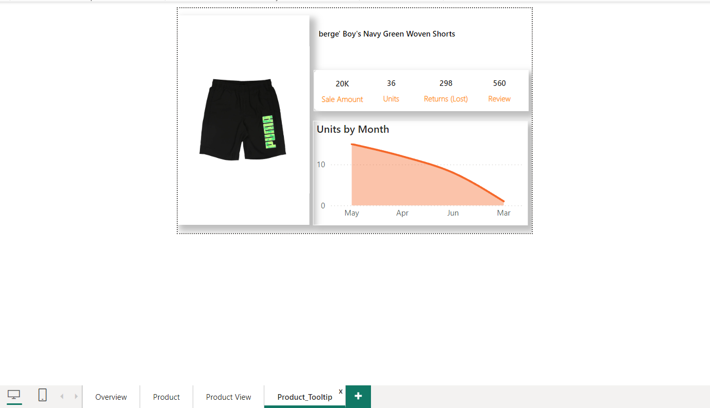

# Power BI Projects 

This repository contains Power BI dashboards designed to visualize and analyze various business scenarios. The dashboards incorporate advanced data transformation, dynamic visualizations, and interactive features, providing actionable insights to help users explore the data effectively.  

---
---

## **Projects List**  
1. [Data Professional Survey Breakdown Insights](#project-data-professional-survey-breakdown-insights---power-bi)  
2. [Amazon Product Sales Insights Dashboard](#amazon-product-sales-insights-dashboard)

---

## **Project 1:**

## **Project: Data Professional Survey Breakdown Insights - Power BI**

This project presents a comprehensive analysis of a **Data Professional Survey** using **Power BI**. The dataset provides valuable insights into various aspects of the data industry, such as job roles, salaries, skills, and career growth. This project demonstrates how to transform raw survey data into dynamic, interactive visualizations, offering a deeper understanding of the trends and patterns within the data industry.

### **Overview**
The goal of this project is to analyze and visualize the results of a survey of data professionals using Power BI. By exploring job roles, salary trends, skills in demand, and other critical factors, the dashboard provides actionable insights for both job seekers and employers in the data industry.

### **Key Visualizations**
1. **Survey Breakdown by Job Role**  
   A bar chart that visualizes the distribution of survey respondents by their job roles within the data industry, such as data scientists, analysts, and machine learning engineers.

2. **Salary by Job Role and Experience**  
   A scatter plot that compares salary data with years of experience across various data roles. This visualization highlights how salaries vary with experience in different job titles.

3. **Skills in Demand**  
   A stacked bar chart that shows the most frequently mentioned technical skills in the data industry, offering a clear view of what skills are currently in demand.

4. **Job Satisfaction and Career Growth**  
   A combination of pie charts and line graphs illustrating job satisfaction levels, career growth expectations, and overall sentiment within the data community.

5. **Regional Distribution of Data Professionals**  
   A map that displays the distribution of data professionals by geographic region, revealing trends in where data jobs are concentrated.

### **Power BI Features Demonstrated**
- **Data Transformation**: The raw survey data was transformed and cleaned using Power Query to make it suitable for analysis.
- **Interactivity**: Added slicers and filters to allow users to interact with the data, such as filtering by job role or region.
- **Advanced Visualization**: Leveraged Power BI’s charting capabilities, including bar charts, scatter plots, maps, and pie charts, to create informative and visually appealing dashboards.
- **Trend Analysis**: Generated insights on career growth and job satisfaction over time, helping data professionals understand key factors influencing their job market.

### **Dashboard Image**
Here’s a screenshot of the interactive Power BI dashboard:

### **Project Outcome**
This Power BI dashboard provides a detailed view of the data industry based on the survey responses. It offers a user-friendly way to explore job trends, salary expectations, and career growth patterns. By leveraging interactivity, users can drill down into specific areas to uncover more detailed insights, making this a powerful tool for both career development and organizational strategy.

### **Conclusion**
This project showcases the ability to analyze survey data and visualize it in a meaningful way using Power BI. The interactive nature of the dashboard allows users to explore various aspects of the data industry and uncover valuable insights that can help with career decisions, hiring strategies, and industry forecasting.

---
---

## **Project 2:**
## **Amazon Product Sales Insights Dashboard**

This Power BI project focuses on analyzing Amazon product-wise sales data. The goal was to create an interactive and visually rich dashboard that provides valuable insights into product performance across various regions, categories, and time periods. The dashboard incorporates advanced data transformation, user interactivity, and storytelling through dynamic visualizations.

---

### **Key Steps in the Project**

1. **Data Import and Integration**
   - Integrated multiple data sources to bring in Amazon product-wise sales data.
   - Ensured data consistency and completeness before transformation and analysis.

2. **Data Transformation and Cleaning**
   - Removed duplicates and irrelevant data using Power Query Editor for data accuracy.
   - Standardized product names, sales data, and dates for consistency.
   - Filled or removed null values to ensure seamless analysis.
   - Enhanced data analysis with calculated columns and measures using DAX.

3. **Dynamic Slicers and Filters**
   - Created interactive slicers for categories, regions, and product types to empower users to drill down into specific datasets.
   - Enabled a fluid exploration of sales data across different dimensions.

4. **Visually Rich Dashboards**
   - Designed a clean, professional dashboard layout focusing on user navigation.
   - Incorporated bar charts, line graphs, and KPI cards to visualize sales and revenue trends.
   - Highlighted top-performing products with conditional formatting.

5. **Custom Navigation and Layout**
   - Developed easy-to-use navigation with interactive buttons and icons, enhancing accessibility and user experience.
   - Ensured seamless transitions between different sections of the dashboard.

6. **Working with Tables and DAX Formulas**
   - Created dynamic tables displaying detailed product-wise sales data.
   - Used DAX formulas to calculate year-over-year growth and total sales figures.

7. **Interactive Buttons and Icons**
   - Added custom buttons for smooth navigation across dashboard pages.
   - Designed intuitive icons to highlight essential metrics like best-selling products.

8. **Conditional Logic and Dynamic Views**
   - Implemented logic to dynamically show or hide slicers and panels based on user actions.
   - Designed conditional tooltips for deeper insights upon hovering over visuals.

9. **Visibility Management**
   - Enabled the ability to toggle visibility of less-used elements to keep the dashboard clean.
   - Simplified the interface by showing essential components only when necessary.

10. **Visualizations and Storytelling**
    - Displayed sales distribution using pie charts and geographical heatmaps for clear insights.
    - Incorporated dynamic visuals that update based on selected filters and slicers.

11. **Customizing Slicers for Sales Metrics**
    - Enabled real-time updates through dynamic slicers, allowing users to toggle between revenue, profit, and quantity metrics.
    - Used DAX to ensure consistent data reflection based on user choices.

12. **Data Relationships and Seamless Flow**
    - Established relationships between different tables (categories, regions, and sales data).
    - Ensured that data flows seamlessly between dashboard pages, providing a holistic view of sales performance.

13. **Standardizing Visuals**
    - Used the format painter tool to ensure a consistent and polished visual style across all dashboard elements.

14. **Dashboard Pages Customization**
    - Created dedicated pages for detailed product analysis, revenue trends, and category performance.
    - Each page offers focused insights with a user-friendly layout.

15. **Enhancing Slicer Panel Efficiency**
    - Resolved slicer panel alignment and configuration issues for a smoother user experience.

16. **Tooltips and Additional Insights**
    - Added custom tooltips to provide additional context and insights on key metrics like product ratings.

17. **Optimizing Layout for Key Metrics**
    - Focused on displaying high-priority metrics, ensuring the most important data is front and center.

18. **Managing Null Values**
    - Excluded blank or null values from reports and visuals to maintain data accuracy.

19. **Date Slicers for Time-Based Analysis**
    - Enabled dynamic date slicers, allowing users to explore product sales across different time periods.

20. **Advanced Visual Enhancements**
    - Incorporated advanced visualizations like clustered bar charts and waterfall charts to provide more granular insights.
    - Used animations and transitions for enhanced storytelling.

---

  ### **Dashboard Screenshots**  
- **Page 1: Overview**  
  (Placeholder for Page 1 - Dashboard Screenshot: Overview of overall sales performance, key metrics, and trends.)
    
  
  ---  

- **Page 2: Product Insights**  
  (Placeholder for Page 2 - Dashboard Screenshot: Detailed insights into product categories, revenue distribution, and performance trends.)
     
  
  ---    

- **Page 3: Product View**  
  (Placeholder for Page 3 - Dashboard Screenshot: Individual product analysis, including sales performance, profitability, and customer ratings.)
     
  
  ---    

- **Page 4: Product Tooltip**  
  (Placeholder for Page 4 - Dashboard Screenshot: Interactive tooltips displaying additional product details and contextual insights on hover.)
     
    

---

### **Key Skills Demonstrated**
- Advanced data transformation and cleaning with Power Query.
- Creation of dynamic DAX measures and calculated columns.
- Interactive, user-friendly dashboard design and navigation.
- Storytelling through dynamic visualizations and clear insights.
- Effective problem-solving for handling data integrity and slicer issues.

---

This project showcases my expertise in Power BI, emphasizing advanced data analysis, user interaction, and effective visualization techniques. The **Amazon Product Sales Insights Dashboard** provides business stakeholders with clear insights into product performance, enabling data-driven decision-making.

---
---
