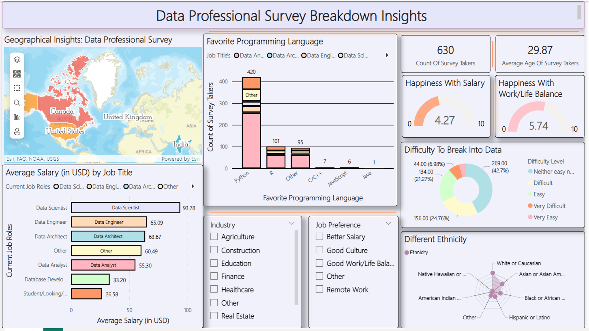

# Power-BI
This repository contains a Power BI dashboard designed to visualize and analyze ,describe the data or business problems. The dashboard includes various insights and interactive elements to help users explore the data.

---

## **Project: Data Professional Survey Breakdown - Power BI**

This project presents a comprehensive analysis of a **Data Professional Survey** using **Power BI**. The dataset provides valuable insights into various aspects of the data industry, such as job roles, salaries, skills, and career growth. This project demonstrates how to transform raw survey data into dynamic, interactive visualizations, offering a deeper understanding of the trends and patterns within the data industry.

### **Project Overview**
The goal of this project is to analyze and visualize the results of a survey of data professionals using Power BI. By exploring job roles, salary trends, skills in demand, and other critical factors, the dashboard provides actionable insights for both job seekers and employers in the data industry.

### **Key Visualizations**
1. **Survey Breakdown by Job Role**  
   A bar chart that visualizes the distribution of survey respondents by their job roles within the data industry, such as data scientists, analysts, and machine learning engineers.

2. **Salary by Job Role and Experience**  
   A scatter plot that compares salary data with years of experience across various data roles. This visualization highlights how salaries vary with experience in different job titles.

3. **Skills in Demand**  
   A stacked bar chart that shows the most frequently mentioned technical skills in the data industry, offering a clear view of what skills are currently in demand.

4. **Job Satisfaction and Career Growth**  
   A combination of pie charts and line graphs illustrating job satisfaction levels, career growth expectations, and overall sentiment within the data community.

5. **Regional Distribution of Data Professionals**  
   A map that displays the distribution of data professionals by geographic region, revealing trends in where data jobs are concentrated.

### **Power BI Features Demonstrated**
- **Data Transformation**: The raw survey data was transformed and cleaned using Power Query to make it suitable for analysis.
- **Interactivity**: Added slicers and filters to allow users to interact with the data, such as filtering by job role or region.
- **Advanced Visualization**: Leveraged Power BI’s charting capabilities, including bar charts, scatter plots, maps, and pie charts, to create informative and visually appealing dashboards.
- **Trend Analysis**: Generated insights on career growth and job satisfaction over time, helping data professionals understand key factors influencing their job market.

### **Dashboard Image**
Here’s a screenshot of the interactive Power BI dashboard:

### **Project Outcome**
This Power BI dashboard provides a detailed view of the data industry based on the survey responses. It offers a user-friendly way to explore job trends, salary expectations, and career growth patterns. By leveraging interactivity, users can drill down into specific areas to uncover more detailed insights, making this a powerful tool for both career development and organizational strategy.

### **Conclusion**
This project showcases the ability to analyze survey data and visualize it in a meaningful way using Power BI. The interactive nature of the dashboard allows users to explore various aspects of the data industry and uncover valuable insights that can help with career decisions, hiring strategies, and industry forecasting.

---

This portfolio provides a comprehensive description of your **Power BI** project, showcasing your ability to work with data, create meaningful visualizations, and present insights through an interactive dashboard. The dashboard image will allow potential employers or collaborators to explore your work in more detail

---

